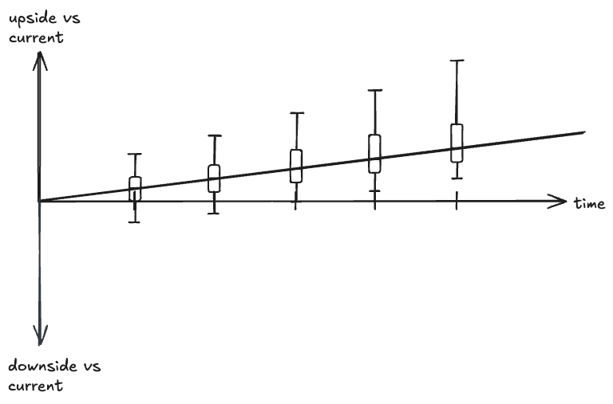
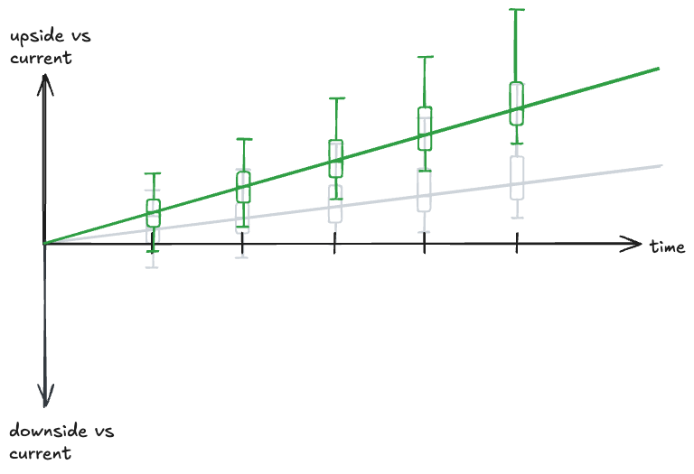
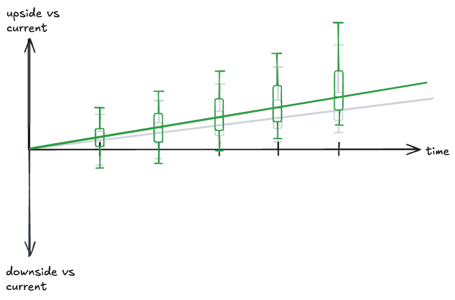
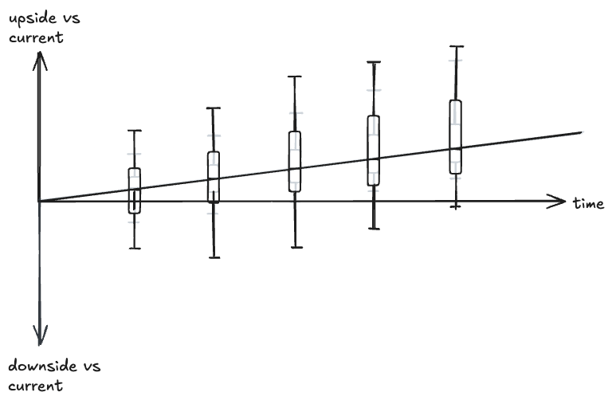
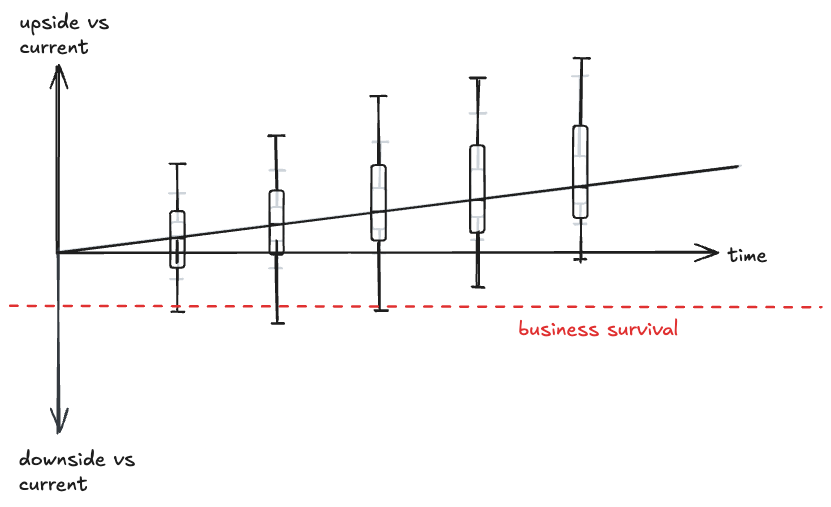

Lately we've been thinking about fundraising at work.  We've built a good product and a business with gathering momentum
and positive unit economics.  Even without a raise we're likely to be in the black in a reasonable amount of time –
knock on wood – or as Silicon Valley likes to say, [default alive](https://paulgraham.com/aord.html).

The knee-jerk response for early stage SV-style startups is "of course you should raise, you can grow faster!" But
another way to phrase "growth opportunity" is "upside risk," and once you say "upside risk" the next natural thought is
"downside risk."

So here's something I've been musing over.  The outcome distribution of a good business with some level of history
probably looks roughly like this:

(Defining "box plot" is outside the scope of this post, please see the wiki page :))

There's always some variation because that's life and the universe, but generally if it's a decent business it will grow
at some minimum rate above the overall market.  If it's a good/great business, the distribution of downside will get
lower from stabilization of operations and upside will get higher from natural expansion and moat-building.  Over the
long term, it's likely to end up ahead of where it was.

It's tempting to think of executing a "growth opportunity" as something like this:

The median outcome gets nudged upwards but the level of variance stays the same.  Except that's a free lunch, and
there's no such thing as a free lunch.  Any initiative strong enough to introduce upside risk will naturally introduce
downside risk.  Spinning up a new team incurs additional costs, bringing on investors increases potential for strategic
misalignment, etc etc.  Realistically, a good growth case probably looks more like this:

There's larger downside risk in the short term because of disruption from the changes, but the downside is asymmetric.
The more asymmetric your bet, the more upside you get in exchange.  Over time the business adapts and captures
additional opportunity, it ends better than the base case, and Bob's your uncle.

But it's also easy to accidentally do this with your changes:

... AKA the "yolo bet."  The median stays the same, but you've blown out both ends of your risk distribution.  This is a
bet that's ~usually not a great one, because there's one line missing in the charts thus far:

Most of the time, the ability to absorb downside is limited: at some point, it will just kill the company.
Nevertheless, there are valid reasons to make the yolo bet. The obvious one is if the business is actually down-trending
and you need a Hail Mary.  Or perhaps you subscribe to the extreme end of the Silicon Valley ethos: feed it to see if
it's a unicorn, and if it's not then better to fail fast and move on with your search.

But even in those cases, I think it's best to go in eyes open and fully aware of the bet being made.
