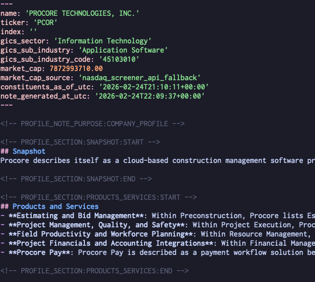

Recently I joined the cool kids in using Claude Code / Codex + a bag-of-md’s as a sort of research assistant / second
brain notes repo. So far they've been self-isolated smaller repos but the most interesting one is probably company
research. tl;dr - I now have a completely vibe-coded bag of skills + python scripts that do things like download + cache
sec docs, trustpilot reviews, etc. One of the workflows is if I see a company I’m curious about, I can just go “do me a
full writeup on procore” and get something that looks like this as a starter:

... Which I can then work on as I decide to dig in further / not. This report + saved materials can also be used for quick
Q&A and stress testing ideas ("XYZ startup claims to (fancy ai doc thing) for construction, who are the incumbents + are
they already trying to do this ..."). There are also some gardening skills just around keeping things clean + formatted +
consistent across different files.

I've been thinking about slapping some nicer md rendering + maybe editing around this -- unlike the cool kids, I am not a
huge fan of Obsidian these days.

Also wonder if it would be useful to have a second brain tool that is more purpose-built + works out of the box,
especially for the other 95% of the internet that is not going to use Claude Code. (Or maybe everyone will eventually
use Claude Code!  Non-technical people seem willing enough to yolo-roll OpenClaw.)
